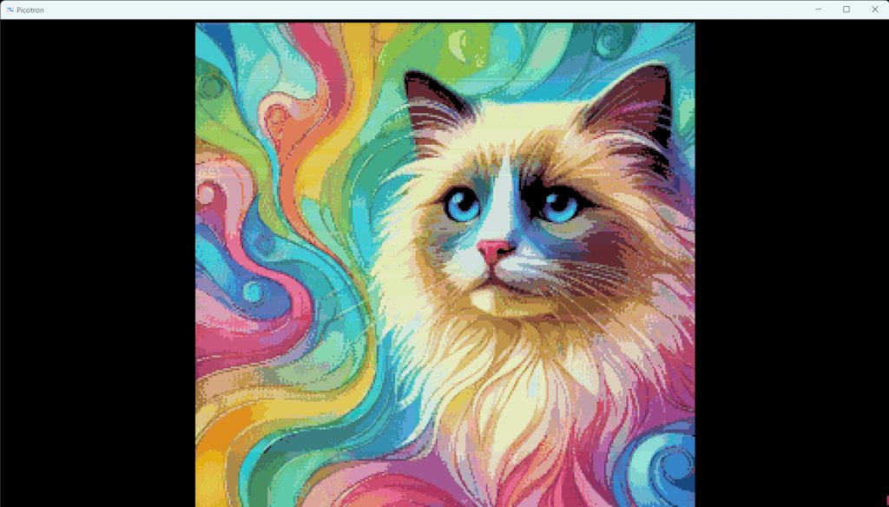
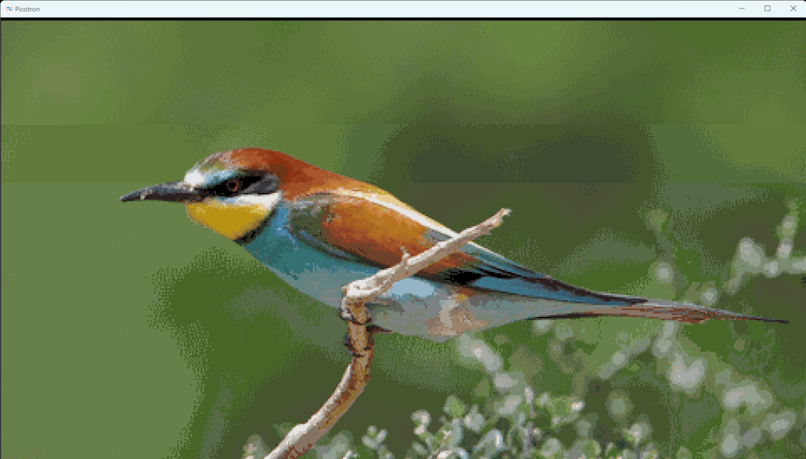
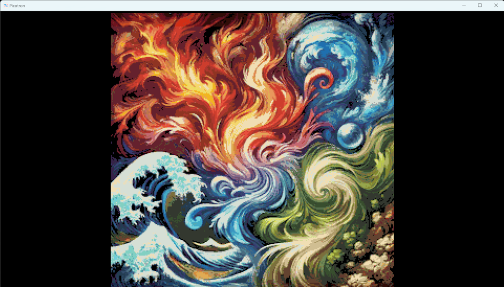
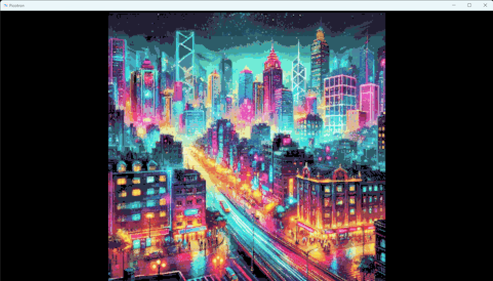
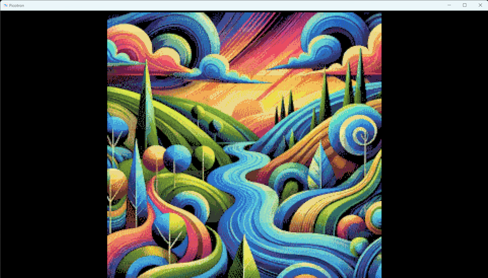
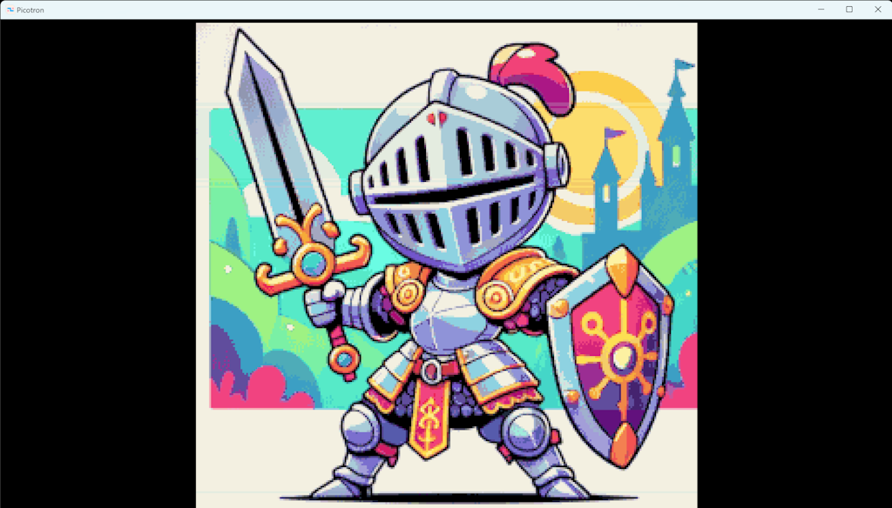

## QPB Image Format

### Overview

The QPB (Quad Palette Bitmap) Image Format project provides two Lua scripts, `png2qpb.lua` and `qpbview.lua`, designed for the Picotron environment. These scripts facilitate the conversion of PNG images into the QPB format and the subsequent viewing of these QPB images within Picotron.

### QPB Format Explained

The QPB (Quad Palette Bitmap) format is tailored for Picotron games, making it ideal for vibrant game intros or background scenes. Key features include:

- Up to four different palettes can be assigned to different horizontal sections of the image.
- During conversion, colors are processed in the CIELAB color space, enhancing color differentiation and clustering for more accurate and visually pleasing palettes.
- Supports up to 256 different colors.













### `png2qpb.lua`

This script converts PNG images into the QPB format.

##### How to Use

To convert a PNG image to the QPB format, use the following command within Picotron:

```bash
png2qpb <filename> <default_colors> <epsilon>
```

- `filename`: The path to the PNG file.
- `default_colors`: (Optional) The number of colors to retain from the default palette (default: 16).
- `epsilon`: (Optional) Tolerance for color comparisons (default: 0.0001).

**Example:**

```bash
png2qpb city.png 16 0.0001
```

##### Default Colors

The `default_colors` parameter determines the number of colors from a predefined palette that will be preserved in the final image. By default, 16 colors are retained, but this can be adjusted according to specific needs, ensuring that critical design elements maintain their intended colors.

##### Tolerance (`epsilon`)

The `epsilon` parameter defines the sensitivity for distinguishing between similar colors. A lower value maintains more distinct colors, while a higher value groups similar colors together, which can be useful for reducing the color palette.

##### Image Pre-processing

Before using `png2qpb`, consider reducing the number of colors and applying dithering to your image using an external editor. This preparation can enhance the final QPB image's quality by improving color transitions and handling gradients more effectively.

### `qpbview.lua`

This script allows for the viewing of QPB images in Picotron and serves as a practical example of how to render these images.

##### How to Use

To view a QPB file, use the following command within Picotron:

```bash
qpbview <filename>
```

- `filename`: The path to the QPB file.

**Example:**

```bash
qpbview city.qpb
```

The viewer displays the QPB image centered on the screen, applying the necessary palettes for correct rendering. `qpbview.lua` can also serve as a reference for integrating QPB image rendering into other Picotron projects.

### TODO and known issues

Planned improvements for the QPB Image Format include:

1. Better aligning of palettes to make similar colors look same in all parts of image.
2. Making the conversion process faster and more efficient.
3. Implementing advanced dithering to enhance color representation in limited color scenarios.
4. Developing more accurate metrics for clustering colors, improving palette quality.
5. Adding support for algorithms like Median Cut and Octree for better control over color depth and quality.

### Author and License

- **Created by**: Andrew Vasilyev
- **License**: Released under the GNU General Public License v3.0. You are free to use, modify, and distribute these scripts. More details are available at [GNU GPL v3.0](https://www.gnu.org/licenses/gpl-3.0.html).

### How to Contribute

To contribute, fork the repository, implement your changes, and submit a pull request. Please ensure your code is clean and adheres to the project's coding standards.

### Contact

For questions or support, contact Andrew Vasilyev at [me@retran.me](mailto:me@retran.me).